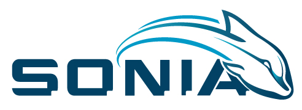

#  Welcome to S.O.N.I.A. Project Documentation

Team SONIA (Système d’Opération Nautique Intelligent et Autonome), from École de technologie supérieure, is an undergraduate student association that builds an Autonomous Underwater Vehicle (AUV) to perform at the annual RoboSub competition held in San Diego, California.

Since our beginning in 1999, we have developed 8 AUV prototypes with the goal of competing at the AUVSI and ONR’s International Autonomous Underwater Vehicle Competition.

At SONIA we love to share our idea and develop great collaboration with people around the world.

The code is open source, and available on Github.

This documentation is organized into a couple section:

- [User Documentation](#user)
- [Software Documentation](#software)
- [Electrical Documentation](#electrical)
- [Mechanical Documentation](#mechanical)
- [Proof of Concept (French only)](#POC)
- [About S.O.N.I.A.](#about)

## User Documentation 

- [Getting Started](user/getting_started.md)
- [Installation](user/installation.md)
- [C++ Style Guide](user/c++_style_guide.md)
- [Environment](user/environment.md)

## Server Documentation 

- [Getting started](server/getting_started.md)
- [Installation](server/installation.md)
- [Orchestration](server/orchestrxation.md)

## Software Documentation 

- [Overview](software/overview.md)
- [Interface RS485](software/interface_RS485.md)
- [Provider DVL](software/provider_dvl.md)
- [Provider IMU](software/provider_imu.md)
- [Provider Sonar](software/provider_sonar.md)
- [Provider Media](software/provider_media.md)
- [Proc Vision](software/proc_vision.md)
- [Proc Navigation](software/proc_navigation.md)
- [Proc Mapping](software/proc_mapping.md)

## Electrical Documentation 

- [Overview](electrical/overview.md)
- [Hydrophones](electrical/hydrophones.md)
- [DVL](electrical/dvl.md)

## Mechanical Documentation 

- [Overview](mechanical/overview.md)

## Proof of Concept 

- [2018-2019](POC/2018_2019.md)

## About S.O.N.I.A. 

- [The Project](about/project.md)
- [Open Source Philosophy](about/open_source.md)
- [Sponsors of S.O.N.I.A.](about/sponsors.md)
