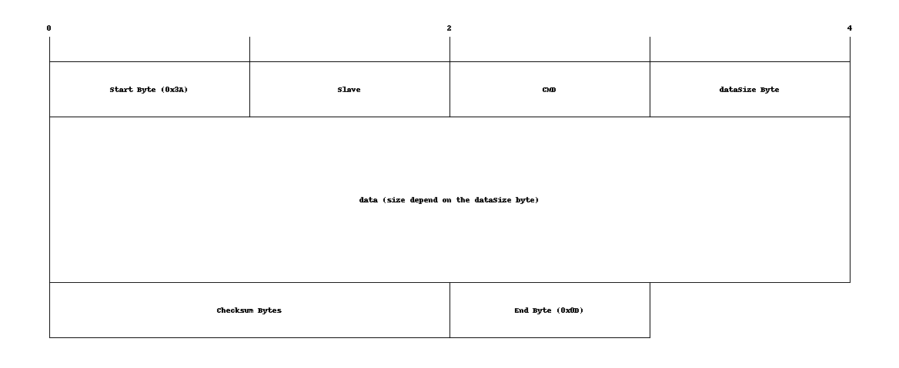

# Interface RS485

## overview

interface RS485 bridge the software and the RS485 protocol.

## algorithm

RS485 use 4 different threads and two thread-safe queue (writerQueue and parseQueue). the first thread, the main thread, stay in the ros spin and receive the data from ros. the second thread, the reader thread, read on the serial file and push the data on the parseQueue. the third thread, the parser thread, take the byte in the parseQueue and parse them into a ros message. the fourth thread, the writer thread, take the message in the writerQueue, parse it and send the byte in the serial file.

## Ros message
###SendRS485Msg
	# SLAVE ID

	uint8 SLAVE_powersupply0 = 49
	uint8 SLAVE_powersupply1 = 50
	uint8 SLAVE_powersupply2 = 51
	uint8 SLAVE_powersupply3 = 52
	uint8 SLAVE_killMission = 32
	uint8 SLAVE_ISI_PWM = 16
	uint8 SLAVE_ISI_1 = 17
	uint8 SLAVE_ISI_2 = 18
	uint8 SLAVE_ISI_3 = 19
	uint8 SLAVE_ISI_4 = 20
	uint8 SLAVE_ISI_5 = 21
	uint8 SLAVE_ISI_6 = 22
	uint8 SLAVE_ISI_7 = 23
	uint8 SLAVE_ISI_8 = 24
	uint8 SLAVE_IO_CTR = 64

	#CMD
	# les define de la kill mission switch
	uint8 CMD_MISSION  		    =0
	uint8 CMD_KILL	  		    =1
	# les define du powersupply
	uint8 CMD_PS_V16_1  		=0
	uint8 CMD_PS_V16_2	     	=1
	uint8 CMD_PS_V12	  		=2
	uint8 CMD_PS_C16_1	    	=3
	uint8 CMD_PS_C16_2	  	    =4
	uint8 CMD_PS_C12	  		=5
	uint8 CMD_PS_temperature	=6
	uint8 CMD_PS_VBatt		    =7

	 #define de ISI
	uint8 CMD_ISI_power = 0

	uint8 CMD_PS_ACT_12V        = 16
	uint8 CMD_PS_ACT_16V_1      = 17
	uint8 CMD_PS_ACT_16V_2      = 18

	uint8 CMD_PS_CHECK_12V        = 19
	uint8 CMD_PS_CHECK_16V_1      = 20
	uint8 CMD_PS_CHECK_16V_2      = 21

	uint8 CMD_POWERSUPPLY_action1 = 2

	# define IO CONTROL
	uint8 CMD_IO_TEMP = 0
	uint8 CMD_IO_DROPPER_PORT = 1
	uint8 CMD_IO_DROPPER_STARBOARD = 2
	uint8 CMD_IO_TORPEDO_PORT = 3
	uint8 CMD_IO_TORPEDO_STARBOARD = 4
	uint8 CMD_IO_LEAK_SENSOR_FRONT = 17
	uint8 CMD_IO_LEAK_SENSOR_RIGHT = 18
	uint8 CMD_IO_LEAK_SENSOR_BACK = 19
	uint8 CMD_IO_LEAK_SENSOR_LEFT = 20

	uint8 DATA_IO_DROPPER_RESET = 0
	uint8 DATA_IO_DROPPER_LAUNCH = 1

	uint8 DATA_IO_TORPEDO_RESET = 0
	uint8 DATA_IO_TORPEDO_ARMED = 1
	uint8 DATA_IO_TORPEDO_LAUNCH = 1

	# SERVICE DEFINITION

	uint8 slave
	uint8 cmd
	uint8[] data
	
## RS485 structure

the cmd and the slave value can be found in the ros message definition.

## useful documentation

[serial programming in posix](https://www.cmrr.umn.edu/~strupp/serial.html)
