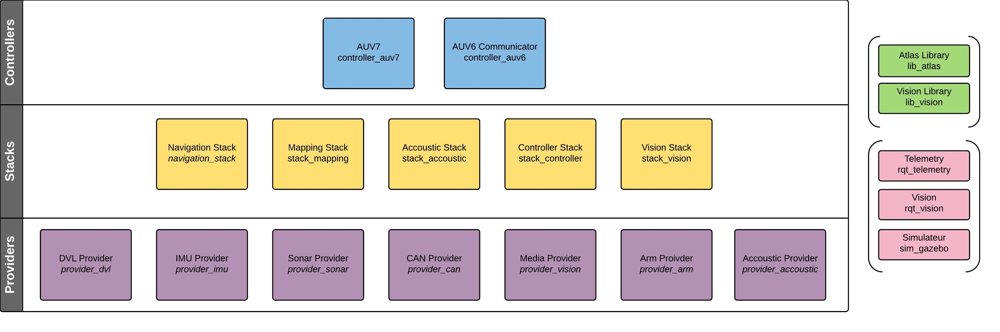

Software Architecture Overview
==============================

In order to offer S.O.N.I.A. Software more modularity and maintainability, we decided to construct our architecture with layers. All layers should be totaly independent of the one above in order to minimize the impact of a modification on a packet API.

As you can see on the design scheme, you will find three different layers wich are:

- The Providers
- The Stacks
- The Controllers

There is also two categories of packages that are used by all the packages:

- The Libraries
- The GUI Softwares

As the libraries are used by all the software, this is a critical component of our system.

Providers
---------

The provider layer contains all packages that allows us to have the raw data dans basic access on our devices.
Theses packages aims to be general and independent of the model of the device that is being used.

ROS is great for this king of application, we provide services and messages on every provider for accessing the features and datas of the devices.

The design also aims to be as flexible as possible and changing the model of a specific provider should be a matter of adding a driver class.

The providers does not have any dependencies on the rest of the system except for the libraries.

Stacks
------

The stacks are the main part of our software. These are the packages that contains our intelligence, all our processing, error correction and other algorithms.

The stacks are using the providers topics and services in order to get there feature and data. There is also few coupling on the stacks providers. For example, the mapping stack depend on the navigation stack, and reciprocally.

The result of the stacks are metadata that consider the environment of the submarine. The algorithms are combining all the raw data with the context of the submarine to provide consistent and accurate metadata, such as the location and direction of the submarine, the position of a specific object, the result of image processing on the cameras images, etc.

As the stack packages are usually substential packages, we insist on the design and conception of these packages. Therefore, you will be able to find a complete documentation of the stack pages along side of this documentation.

Controllers
-----------

Libraries
---------

GUI
---
