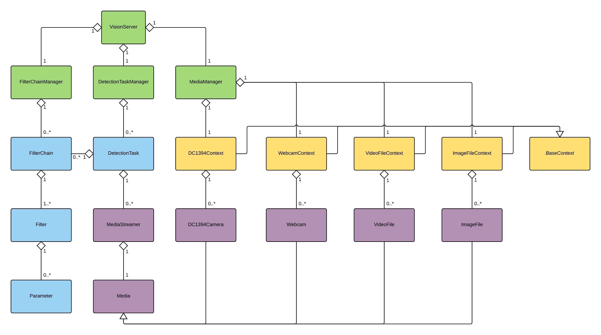

# Proc Vision

This file describe how the provider vision software is interfacing with ROS.
You will find here every information you need about the services and messages.

The vision stacks works just like a server, that is to say, we can send queries which it will responds. However, the response from the vision stack is somewhat different, since it will usually publish data on a topic ROS (as images and data string).
The following diagram illustrates the general operation:

## Collecting and processing data

### Data recovery

The main task of vision server is processing data (video stream). To do this, he must first recover the data before processing.

As part of the implementation of the submarine, the data of interest are the video stream on-board cameras. The Vision server is responsible for managing cameras and recover flows, the user has nothing to do.

It is also possible to load media in so-called static vision server, that is to say, to indicate the path to an image or video stored on its hard drive. The vision server perform the treatments requested on this video from the stream rather than cameras. This is where it happens.

Moreover, when a command to be sent from one execution, the service responds with the base node, that is the basis from which we can find the services connected to execution (image, result of filterChain , etc.)
This database is: `/ vision_server/detection_task_name`.

Picture is available via: `base + 'picture _' and the result of filterChain via base + '_ result'`.
IE: `/vision_server/detection_task_name_image` is the topic and `/ vision_server/detection_task_name_result` the result of filterChain.

### Data processing

The data processing is completely within the vision server, and the principle of a chain of filters that are applied sequentially to the desired data stream (commonly called filter chain).

The filter chains as such are stored in XML files, so you have to ask the vision server load through a query.

Note: This feature is being implemented, currently the vision server applies no filter on the data stream (but the mechanism is implemented).

## Global Architecture

Services ROS

Here is the full list of available services in this ROS packages:

- `stack_vision/execute_cmd`
- `stack_vision/copy_filterchain`
- `stack_vision/get_filterchain_filter_param`
- `stack_vision/set_filterchain_filter_param`
- `stack_vision/get_filterchain_filter`
- `stack_vision/manage_filterchain`
- `stack_vision/save_filterchain`
- `stack_vision/set_filterchain_filter_order`
- `stack_vision/get_information_list`
- `stack_vision/get_media_from_execution`

### `stack_vision/execute_cmd`

The vision server has multiple functional departments. The list can be found in the sonia_msgs / srv record. The most used service is the service to execute a command, that is to say, ask the server to perform a given treatment from a given media and publish this information on a topic.

#### Command

	rosservice call stack_vision/execute_cmd <node_name> <filterchain_name> <media_name> <cmd>

#### Parameters

**node_name :**
string, name of the execution, that corresponds to the topic will be created and where the data will be published.

**filterchain_name :**
string, name of filterChain to apply

**media_name :**
string, media name from which to load images (see below for list of media)

**cmd :**
uint8, order value (1: START 2 STOP)

#### Return Value

**response :**
String containing the name of the topic to which subscribe

!!! Note

	**Webcam :** publish the video stream from your computer's webcam
	**File :**It is also possible to specify the path to media stored on your computer (see section below).
	
	Currently filterChain are not taken into account in treatment.

### `stack_vision/copy_filterchain`

This service allows you to copy a filterChain.

#### Command

	rosservice call stack_vision/copy_filterchain <filterchain_to_copy> <filterchain_new_name>

#### Parameters

**filterchain_to_copy :**
string, name of the copy filterChain

**filterchain_new_name :**
string, name of the new filterChain

### Return Value

**success :**
bool (1: SUCCESS, 0: fail)

### `stack_vision/get_filterchain_filter_param`

This service provides a list of all the parameters of a filter. The values ​​may be different from those contained in the xml file. If the execution is void, gets filters related to filterChain.

#### Command 

	rosservice call stack_vision/get_filterchain_filter_param <detection_task> <filter_chain> <filter>

#### Parameters

**exec_name :**
string, execution name (is the name of a topic on which the data are published)

**filterChain :**
string, name of filterChain

**filter :**
string, filter name

#### Return Value

**list :**
string, paramName1 | Type | value | value_min | value_max | description; ...

### `stack_vision/set_filterchain_filter_param`

This service allows changing the value of a parameter of a filter. If no execution is passed as a parameter, the change is made on the filterChain.

#### Command

	rosservice call stack_vision/set_filterchain_filter_param <detection_task> <filter_chain> <filter> <parameter> <value>

#### Parameters

**exec_name :**
string, execution name (is the name of a topic on which the data are published)

**filterChain :**
string, name of filterChain

**filter :**
string, filter name

**parameter :**
string, name of the parameter

**value :**
string, new value

#### Return Value

**success :**
bool (1: SUCCESS, 0: fail)

### `stack_vision/get_filterchain_filter`

This service allows you to obtain the list of filters associated with an execution. If enforcement is nil, returns the list of filters in the filterChain

#### Command

	rosservice call stack_vision/get_filterchain_filter <detection_task> <filter_chain>

#### Parameters

**exec_name :**
string, execution name (is the name of a topic on which the data are published)

**filterChain :**
string, name of filterChain

#### Return Value

**list :**
string, filterName1; filterName2; ...

### `stack_vision/manage_filterchain_filter`

This service allows you to add or remove a filter from a filterChain. If enforcement is zero, manage the filter associated with the filterChain.

#### Command

	rosservice call stack_vision/manage_filterchain_filter <detection_task> <filter_chain> <filter> <cmd>

#### Parameters

**exec_name :**
string, execution name (is the name of a topic on which the data are published)

**filterChain :**
string, name of filterChain

**filter :**
string, filter name

**cmd :**
uint8, order value (1: ADD 2: DELETE)

#### Return Value

**success :**
bool (1: SUCCESS, 0: fail)

### `stack_vision/manage_filterchain`

This service allows you to add or delete a filterChain.

#### Command

	rosservice call stack_vision/manage_filterchain <filter_chain> <cmd>

#### Parameters

**filterChain :**
string, name of filterChain

**cmd :**
uint8, order value (1: ADD 2: DELETE)

#### Return Value

**success :**
bool (1: SUCCESS, 0: fail)

### `stack_vision/save_filterchain`

This service allows you to save or restore a filterChain and parameters of its filters. If the execution is zero, backup / restore data associated with the filter filterChain.

#### Command

	rosservice call stack_vision/save_filterchain <detection_task> <filter_chain> <cmd>

#### Parameters

**exec_name :**
string, execution name (is the name of a topic on which the data are published)

**filterChain :**
string, name of filterChain

**cmd :**
uint8, order value (1: SAVE, 2: RESTORE)

#### Return Value

**success :**
bool (1: SUCCESS, 0: fail)

### `stack_vision/set_filterchain_filter_order`

This service allows you to change the order of filters a filterChain.

#### Command

	rosservice call stack_vision/set_filterchain_filter_order <detection_task> <filter_chain> <ordered_list>

#### Parameters

**exec_name :**
string, execution name (is the name of a topic on which the data are published)

**filterChain :**
string, name of filterChain

**ordered_list :**
string, filter names in the desired order (blurr; threshold; bin; ...)

#### Return Value

**success :**
bool (1: SUCCESS, 0: fail)

### `stack_vision/get_information_list`

This service allows you to retrieve a list of data on the vision server.

	rosservice call stack_vision/get_information_list <cmd>

#### Parameters

**cmd:**
uint8, used to select the list you want to receive.

!!! Note

	What does what value of cmd?
	
	1. List of executions
	2. List of media
	3. List of filterChain
	4. Filter List

#### Return Value

**list :**
string, contains the desired data separated by a ";" (Ex: EXEC1; EXEC2, ...)

### `stack_vision/get_filterchain_from_execution`

This service allows you to obtain the list of filterChain associated with an execution.

#### Command

	rosservice call stack_vision/get_filterchain_from_execution <detection_task>

#### Parameters

**exec_name :**
string, execution name (is the name of a topic on which the data are published)

#### Return Value

**list :**
string, filterchainName1; filterchainName2; ...

### `stack_vision/get_media_from_execution`

This service allows you to get the media associated with an execution.

#### Command

	rosservice call stack_vision/get_media_from_execution <detection_task>

#### Parameters

**exec_name :**
string, execution name (is the name of a topic on which the data are published)

#### Return Value

**list :**
string, mediaName

